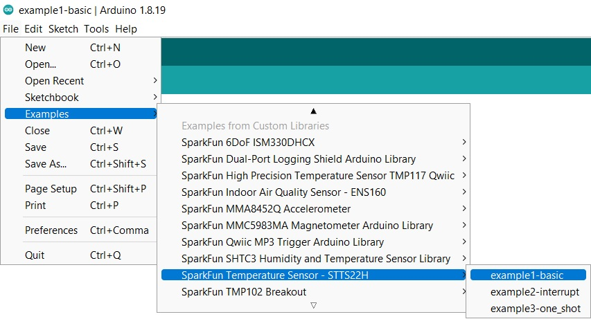
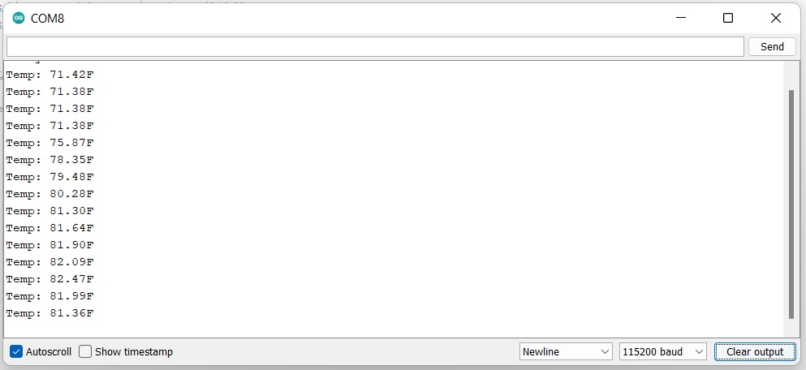
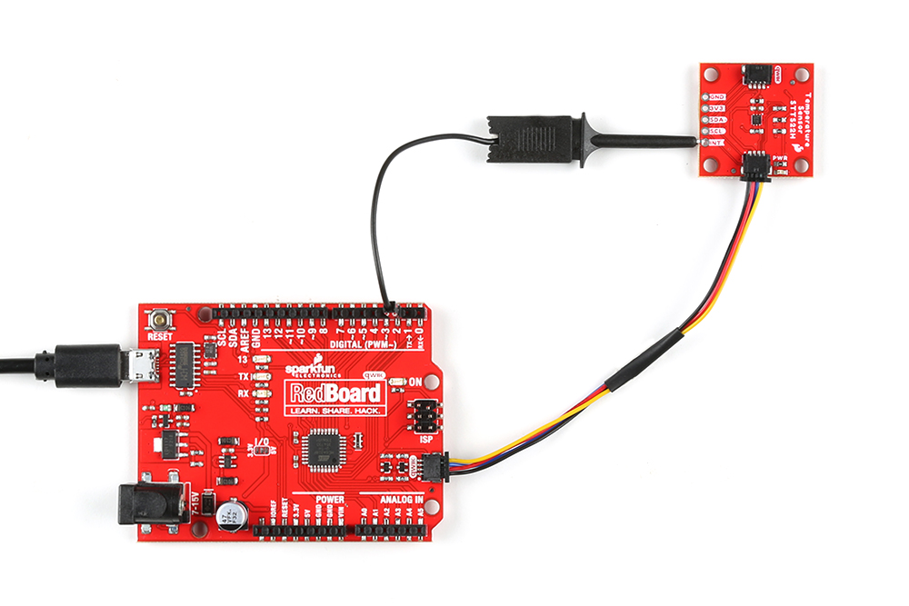
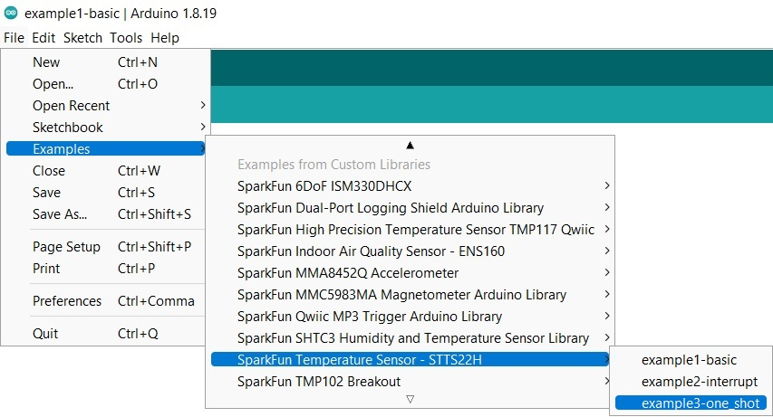
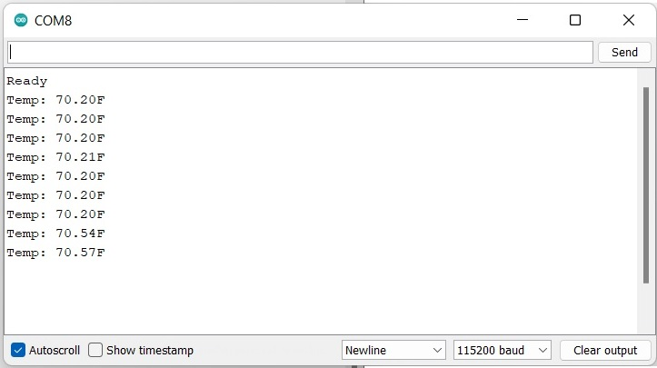

### Example 1: Basic Readings

Now that we've got our library installed and our hardware all hooked up, let's look at some examples.

This first example just does some basic measurements. To find Example 1, go to **File** > **Examples** > **SparkFun Temperature Sensor - STTS22H** > **example1-basic**:

<div style="text-align: center"><a href="../assets/imgs/Example1_Menu.jpg"></a></div>

Alternatively, you can copy and paste the code below to a shiny new Arduino file:

??? "Example 1 Arduino Code"
	```
	--8<-- "https://raw.githubusercontent.com/sparkfun/SparkFun_STTS22H_Arduino_Library/main/examples/example1-basic/example1-basic.ino"
	```

Once you've got your code uploaded, open up a [Serial Monitor](https://learn.sparkfun.com/tutorials/terminal-basics) and check out your output. 

<div style="text-align: center"><a href="../assets/imgs/example1_Output.jpg"></a></div>


### Example 2: Interrupts
Once the library is installed, go ahead and open up **File**->**Examples**->**SparkFun Temperature Sensor - STTS22H** > **example2-interrupt**:

<div style="text-align: center"><a href="../assets/imgs/Example2_Menu.jpg"></a></div>


Make sure to select your board (SparkFun RedBoard) and COM port before hitting upload to begin experimenting with the air quality sensor.
Alternatively, you can copy and paste the code below into a nice new Arduino sketch: 

??? "Example 2 Arduino Code"
	```
	--8<-- "https://raw.githubusercontent.com/sparkfun/SparkFun_STTS22H_Arduino_Library/main/examples/example2-interrupt/example2-interrupt.ino"
	```

Note that depending on which processor board you are using, you may need to alter the Interrupt Pin. Since we're using a RedBoard here, our Interrupt Pin is 2 (`ensInt = 2`). Also, in this example, we've used an [IC hook with a pigtail](https://www.sparkfun.com/products/9741) to connect the Interrupt Pin to the RedBoard pin 2, but you can also [solder headers](https://learn.sparkfun.com/tutorials/how-to-solder---through-hole-soldering) to the STTS22H Temperature Sensor so you can use the interrupt pin. Your hardware hookup should look something like the following: 


<div style="text-align: center"><a href="../assets/imgs/21262-Temperature_Sensor-STTS22H_InterruptExample.jpg"></a></div>


Once you've got your code uploaded, open up a [Serial Monitor](https://learn.sparkfun.com/tutorials/terminal-basics) and check out your output. 


If you have a look at the code, you'll notice that we've set our upper threshhold to 90.5 degrees F, and our lower threshhold to 42 degrees F. I held the sensor in front of a heater to hit the upper threshhold: 

<div style="text-align: center"><a href="..\assets\imgs\example2_Output.jpg"></a></div>

The lower threshhold was reached by sticking the sensor in a plastic bag and then putting that plastic bag into ice water:

<div style="text-align: center"><a href="..\assets\imgs\example2_Output_LowerThresh.jpg"></a></div>

### Example 3: One Shot

The One-Shot operating mode of the STTS22H allows for the temperature measurement to be made and then the device puts itself in a power-down condition. In one-shot mode, the sensor current consumption falls to 1.75 µA, though the full breakout board will draw a bit higher due to the LED &etc. 


Go ahead and open up **File**->**Examples**->**SparkFun Temperature Sensor - STTS22H** ->**example3-one_shot**. Make sure to select your board (SparkFun RedBoard) and COM port before hitting upload to begin experimenting with the air quality sensor.

<div style="text-align: center"><a href="../assets/imgs/Example3_Menu.jpg"></a></div>

Alternatively, you can copy and paste the code below into a nice new Arduino sketch: 

??? "Example 3 Arduino Code"
	```
	--8<-- "https://raw.githubusercontent.com/sparkfun/SparkFun_STTS22H_Arduino_Library/main/examples/example3-one_shot/example3-one_shot.ino"
	```
	
	

Once you've got your code uploaded, open up a [Serial Monitor](https://learn.sparkfun.com/tutorials/terminal-basics) and check out your output. You should see something like the following:

<div style="text-align: center"><a href="../assets/imgs/Example3_Output.jpg"></a></div>

This really isn't all that exciting until you measure the current consumption! 


